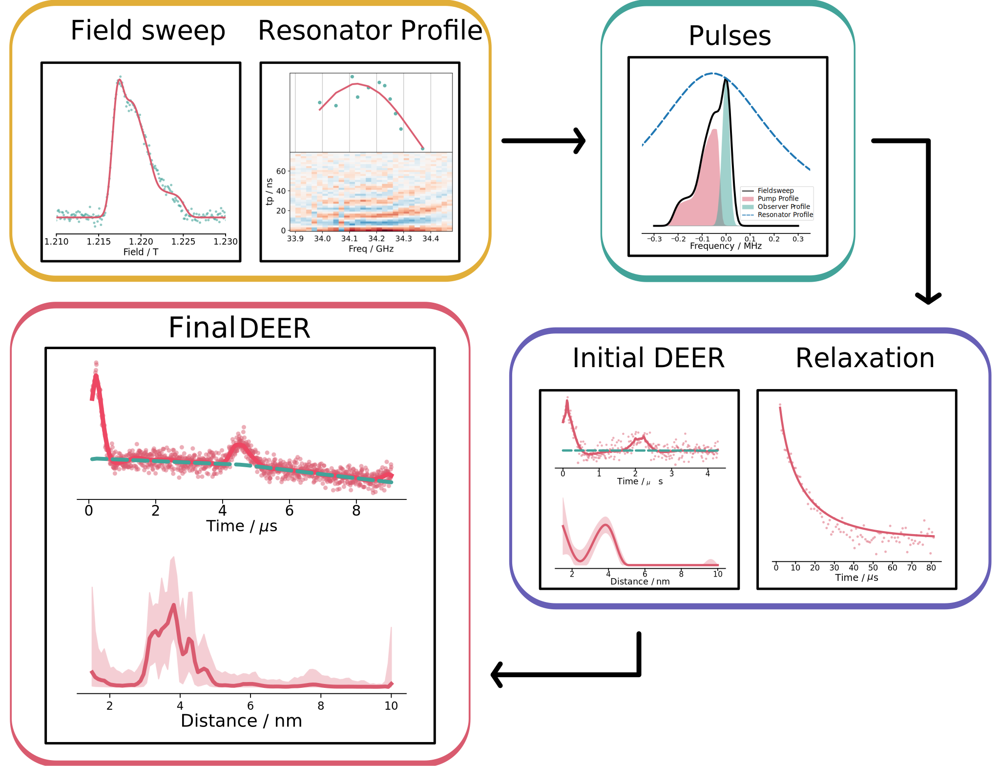

Welcome to autoDEER!
====================================

.. caution:: 
    This documentation is a work in progress and not yet complete. 
    Please be patient and if anything is unclear and please feel free to contact the developers.

autoDEER is a spectrometer independent Python package developed to enable push-button
fully automated DEER. The program is built around a well established and tested optimised algorithum. 
It can be either interfaced using the user friendly GUI or via Python code. Additionally, the backend "autoEPR" can 
be used to build new projects. 

autoDEER's Key Features
-----------------------

- Fully Automated Push Button DEER
- Integrated Fitting
- Spectrometer Independence
- Intuitive Graphical User Interface
- High Quality PDF Report Generator
- and much more...

.. warning:: 
    autoDEER is an actively developed software package, that is still very much a work in process. Please consider this to be a beta release.
      
.. toctree::
    :maxdepth: 1
    :hidden:
    :caption: User Guide

    ./source/Install.rst
    ./source/tutorial.rst
    ./source/API_docs.rst
    ./source/autoEPR/index.rst

.. toctree::
    :hidden:
    :caption: About

    ./source/releasenotes.rst
    ./source/contributing.rst
    Github <https://github.com/JeschkeLab/autoDEER>

