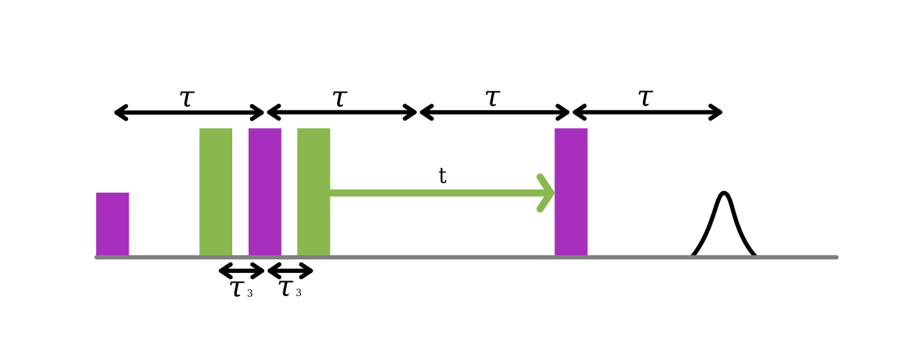
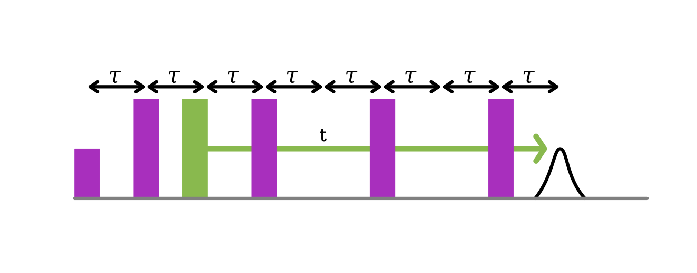

DEER Variants
=============

Over the years many different versions of DEER spectroscopy have been 
developed. Initially, it was 3-pulse and 4-pulse. With the advent of 
high-speed AWGs, the number of sequences expanded, even more, to include 5-pulse, 
7-pulse and nDEER.

AutoDEER currently supports these variants:

1. 4-pulse
2. 5-pulse
3. 7-pulse
4. nDEER of all of the above

Other variants can be created using the autoEPR package. If you would like them
to be added to autoDEER, please make a pull request on GitHub.

Selecting a version
-------------------

..  code-block:: python
    
    sequence = DEERSequence(
        B=LO/gyro_exp, LO=LO,reptime=2e3,averages=1000,shots=50,
        tau1=tau*1e3, tau2=tau*1e3, tau3=0.2*1e3, dt=15,
        exc_pulse=exc_pulse, ref_pulse=ref_pulse,
        pump_pulse=pump_pulse, det_event=det_event)
    sequence.five_pulse()
    sequence.select_pcyc("16step_5p")

It is the ``sequence.five_pulse()`` that selects which DEER sequence to build, 
and the further command ``sequence.select_pcyc("16step_5p")`` selects the 
phase cycle. Depending on the sequence different inter-pulse delays need to be
specified, please check the correct table below.

DEER versions
-------------

4-pulse DEER
++++++++++++

4-pulse DEER was originally called deadtime free DEER. It is formed from a 
refocused echo where a single pump pulse is swept between the two :pi pulses. 

Advantages and Disadvantages

+ If set up with narrow selective pulses can return a signal that mostly only contains a single dipolar pathway.
- Optimising the first inter-pulse delay (tau1) is time-consuming and often not done. Reducing SNR for many samples. 
- Generally, less signal than other sequences. Extracting moderate to long distances from protonated samples is challenging.

**Command:** ``sequence.four_pulse()``

+------+---------------------------------------------------+
| Name | Description                                       |
+======+===================================================+
| tau1 | The first excitation frequency inter-pulse delay  |
+------+---------------------------------------------------+
| tau2 | The second excitation frequency inter-pulse delay |
+------+---------------------------------------------------+

5-pulse DEER
++++++++++++

5-pulse DEER was developed by Borbat et. al. [1] It is a small modification of 4-pulse DEER by adding an additional fixed pump pulse before the first pi pulse.
This change moves the primary dipolar pathway to occur at tau3 after the first pi pulse. The effect of this is that a longer dipolar evolution time
is measurable for a given tau1 + tau2. 

+ Always gives a higher SNR than 4-pulse DEER for the same dipolar modulation depth.
- An additional dipolar pathway is always present 

**Command:** ``sequence.five_pulse()``

+------+---------------------------------------------------------------------------------------+
| Name | Description                                                                           |
+======+=======================================================================================+
| tau1 | The first excitation frequency inter-pulse delay                                      |
+------+---------------------------------------------------------------------------------------+
| tau2 | The second excitation frequency inter-pulse delay                                     |
+------+---------------------------------------------------------------------------------------+
| tau3 | The delay between the first pump_pulse and the first pi pulse. Normally 0.2 or 0.3 us |
+------+---------------------------------------------------------------------------------------+
7-pulse DEER
++++++++++++

.. image:: ../images/7pDEER.svg

7-pulse DEER was developed by Spindler et. al. [2] It involves extending the Carr-Purcell relaxation sequence and having a total of three pump pulses. Two of these
pump pulses move together inwards and one if fixed. 

**Command:** ``sequence.seven_pulse()``

+------+-----------------------------------------------------------------------------------------+
| Name | Description                                                                             |
+======+=========================================================================================+
| tau1 | The first excitation frequency inter-pulse delay                                        |
+------+-----------------------------------------------------------------------------------------+
| tau2 | The second excitation frequency inter-pulse delay                                       |
+------+-----------------------------------------------------------------------------------------+
| tau3 | The third excitation frequency inter-pulse delay                                        |
+------+-----------------------------------------------------------------------------------------+
| tau4 | The delay between the second pump_pulse and the second pi pulse. Normally 0.2 or 0.3 us |
+------+-----------------------------------------------------------------------------------------+

nDEER
+++++

Non-selective DEER (nDEER) was developed by Doll and Jeschke.[3] The basic premise is that instead of only refocusing the excited spins with
the excitation pulses, that you excite all spins.

One version of nDEER allows the pump pulse to be swept through the pi pulses to
extend the dipolar modulation time whilst keeping a high MNR.

**Command:** ``sequence.nDEER_CP()``

+------+---------------------------------------------------+
| Name | Description                                       |
+======+===================================================+
| tau1 | The first excitation frequency inter-pulse delay  |
+------+---------------------------------------------------+
| tau2 | The second excitation frequency inter-pulse delay |
+------+---------------------------------------------------+

Selecting a phase cycle
-----------------------

A selection of pre-programmed phase cycles are included. They can be
chosen with.

..  code-block:: python
    
    sequence.select_pcyc("[Short Code]")

.. |xp| replace:: x\ :sub:`p`

.. table::
    :width: 150
    :widths: 10 10 10 5 30 30 5
    
    +---------------------------+-------------+----------------+--------+---------------------------+-----------------------------+------------+
    | Phase cycle               | Short Code  | Sequence       | Steps  | Pulse Phase Cycle         | Remaining Echoes            | Ref.       |
    +===========================+=============+================+========+===========================+=============================+============+
    | (x)x|xp|x                 | DC          | ALL            | 2      | [+(+x)-(-x)]              | PE12rp, SE(PE12)p3, PE12rpr3|            |
    +---------------------------+-------------+----------------+--------+---------------------------+-----------------------------+------------+
    | (x)[|xp|]x                | 8step_3p    | 3 pulse        | 8      | [+(+x)-(-x)]              |                             |            |
    +---------------------------+-------------+----------------+--------+---------------------------+-----------------------------+------------+
    | x[x][|xp|]x               | 16step_4p   | 4 pulse        | 16     | [+(+x)-(+y)+(-x)-(-y)]    |                             | [1]        |
    +---------------------------+-------------+----------------+--------+                           +-----------------------------+------------+
    | x|xp|[x][|xp|]x           | 16step_5p   | 5 pulse        | 16     | [+(+x)+(+y)+(-x)+(-y)]    | PEp02r3,b PE1p0r2r3b        | [1]        |
    +---------------------------+-------------+----------------+--------+---------------------------+-----------------------------+------------+
    | x[x]|xp|(x)(|xp|)(|xp|)x  | 32step_7p   | 7 pulse        | 32     |                           |                             | [1]        |
    +---------------------------+-------------+----------------+--------+---------------------------+-----------------------------+------------+

References
++++++++++

1. Borbat, P. P., Georgieva, E. R. & Freed, J. H. Improved Sensitivity for Long-Distance Measurements in Biomolecules: Five-Pulse Double Electron–Electron Resonance. J. Phys. Chem. Lett. 4, (2013)
2. Spindler, P. E. et al. Carr–Purcell Pulsed Electron Double Resonance with Shaped Inversion Pulses. J. Phys. Chem. Lett. 6, (2015)
3. Doll, A. & Jeschke, G. Double electron–electron resonance with multiple non-selective chirp refocusing. Phys. Chem. Chem. Phys. 19, (2017)